# PROJECT 2 - LEMP STACK IMPLIMATATION

## STEP 1 – INSTALLING THE NGINX WEB SERVER
`sudo apt update`
`sudo apt install nginx`
**check if nginx has installed successfully**
`sudo systemctl status nginx`
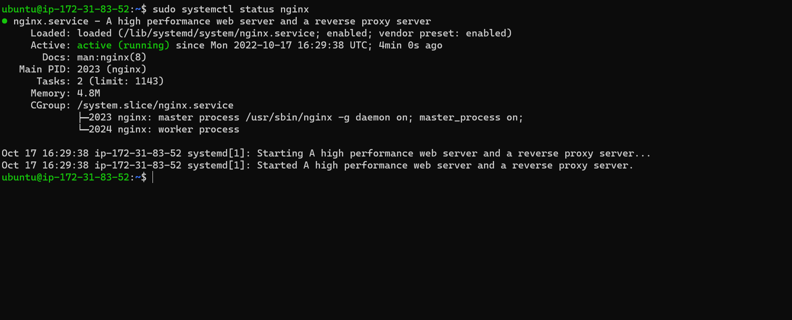

**Access the server locally through port 80 using**
`curl http://localhost:80`
or
`curl http://127.0.0.1:80`

**Access nginx through your browser**
`http://<Public-IP-Address>:80`
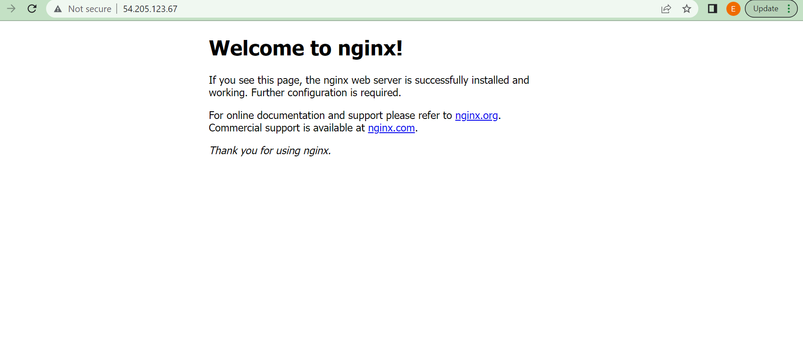
**You can also access your ip address using the code below:**
`curl -s http://169.254.169.254/latest/meta-data/public-ipv4`

##  STEP 2 — INSTALLING MYSQL
### Install mysql using
`$ sudo apt install mysql-server`

### login to mysql
`sudo mysql`
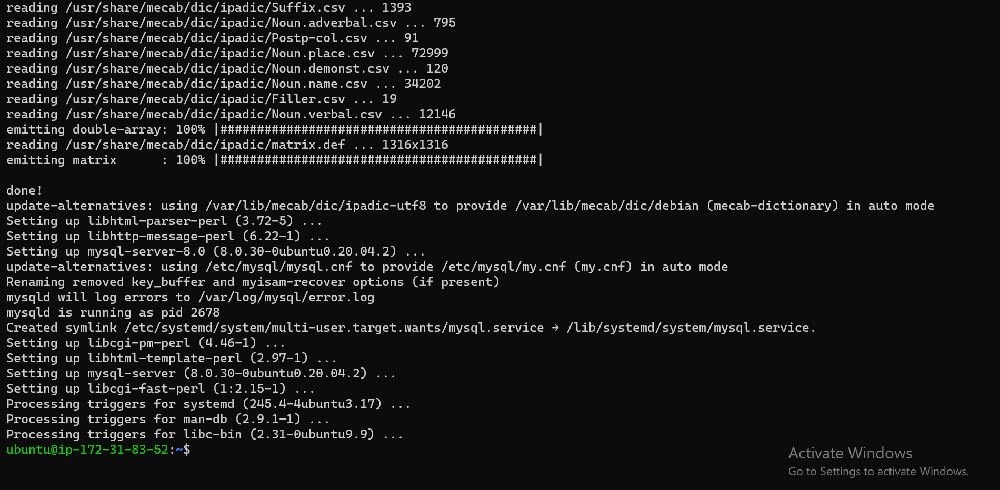
### set a password for the root user
`ALTER USER 'root'@'localhost' IDENTIFIED WITH mysql_native_password BY 'PassWord.1';`

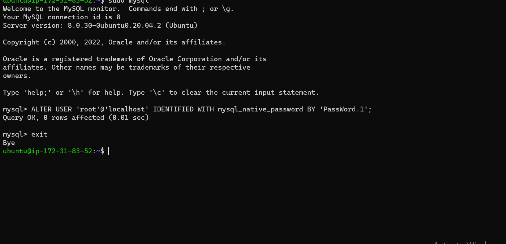

### change password
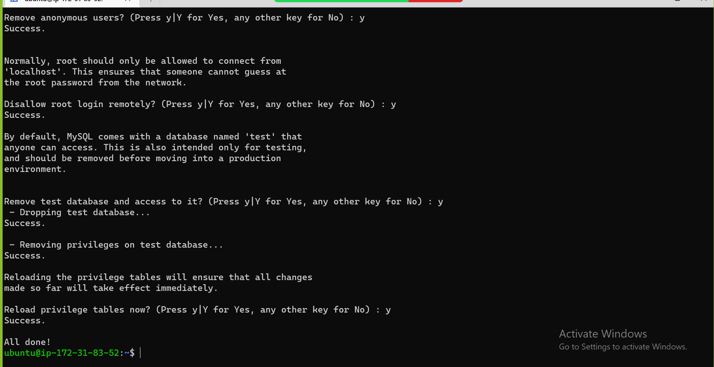
### login again using your password
`sudo mysql -p`

## STEP 3 – INSTALLING PHP
**While Apache embeds the PHP interpreter in each request, Nginx requires an external program to handle PHP processing and act as a bridge between the PHP interpreter itself and the web server. This allows for a better overall performance in most PHP-based websites, but it requires additional configuration. You’ll need to install php-fpm, which stands for “PHP fastCGI process manager”, and tell Nginx to pass PHP requests to this software for processing. Additionally, you’ll need php-mysql, a PHP module that allows PHP to communicate with MySQL-based databases. Core PHP packages will automatically be installed as dependencies.**

`sudo apt install php-fpm php-mysql`
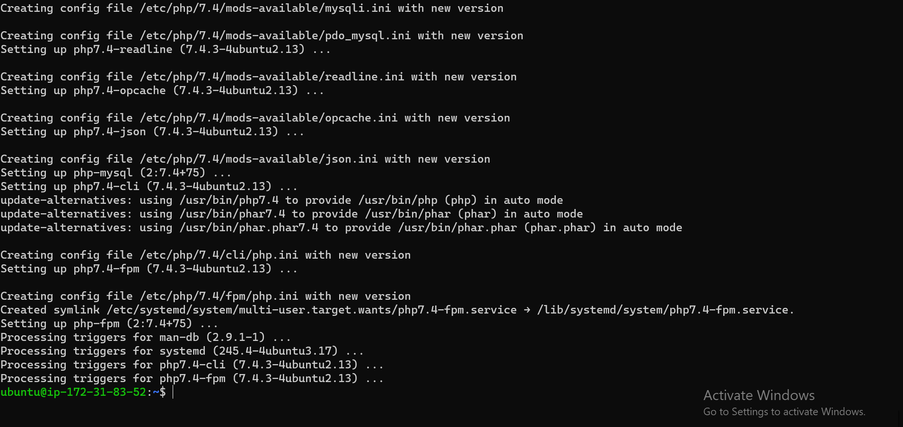

### STEP 4 — CONFIGURING NGINX TO USE PHP PROCESSOR

**On Ubuntu 20.04, Nginx has one server block enabled by default and is configured to serve documents out of a directory at /var/www/html. While this works well for a single site, it can become difficult to manage if you are hosting multiple sites. Instead of modifying /var/www/html, we’ll create a directory structure within /var/www for the your_domain website, leaving /var/www/html in place as the default directory to be served if a client request does not match any other sites.**

**Create the root web directory for your_domain as follows:**
`sudo mkdir /var/www/projectLEMP`
**Assign ownership of the directory with the $USER environmental variable using**
`sudo chown -R $USER:$USER /var/www/projectLEMP`

**Then, open a new configuration file in Nginx’s sites-available directory using your preferred command-line editor. Here, we’ll use nano:**
`sudo nano /etc/nginx/sites-available/projectLEMP`
**paste the code below**

`#/etc/nginx/sites-available/projectLEMP

server {
    listen 80;
    server_name projectLEMP www.projectLEMP;
    root /var/www/projectLEMP;

    index index.html index.htm index.php;

    location / {
        try_files $uri $uri/ =404;
    }

    location ~ \.php$ {
        include snippets/fastcgi-php.conf;
        fastcgi_pass unix:/var/run/php/php8.1-fpm.sock;
     }

    location ~ /\.ht {
        deny all;
    }

}`

**save using ctrl X , Press Y and Enter to exit**
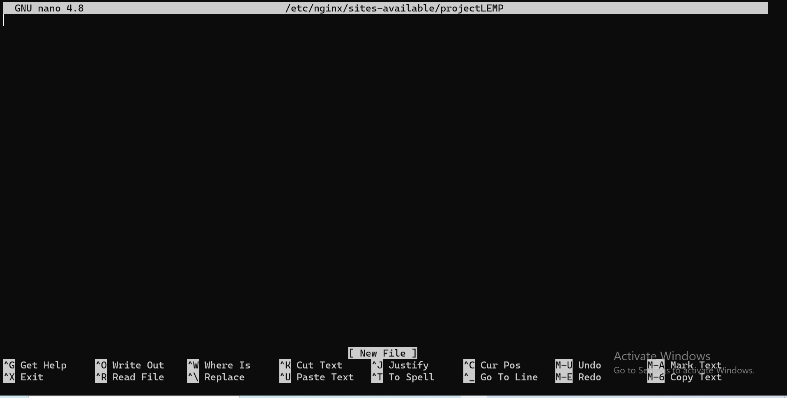

### Activate your configuration by linking to the config file from Nginx’s sites-enabled directory:
`sudo ln -s /etc/nginx/sites-available/projectLEMP /etc/nginx/sites-enabled/`

**This will tell Nginx to use the configuration next time it is reloaded. You can test your configuration for syntax errors by typing:**
`sudo nginx -t`
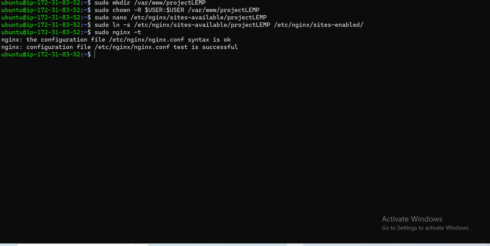

**Disable default nginx using:**
`sudo unlink /etc/nginx/sites-enabled/default`
**Reload to effect changes**
`sudo systemctl reload nginx`
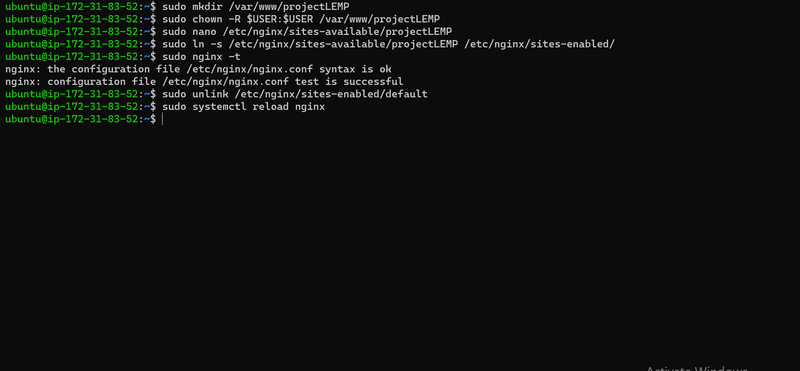

**Create an index.html in that location**
`sudo echo 'Hello LEMP from hostname' $(curl -s http://169.254.169.254/latest/meta-data/public-hostname) 'with public IP' $(curl -s http://169.254.169.254/latest/meta-data/public-ipv4) > /var/www/projectLEMP/index.html`
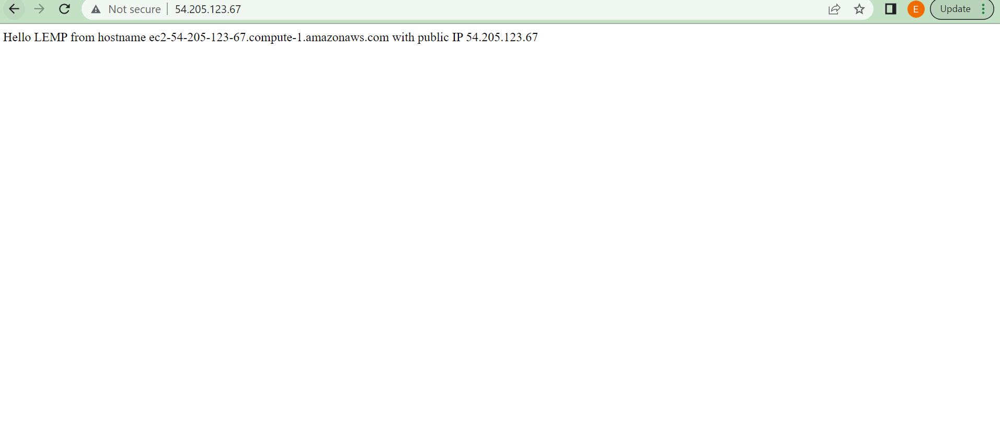

## STEP 5 – TESTING PHP WITH NGINX
**You can test it to validate that Nginx can correctly hand .php files off to your PHP processor.**
**You can do this by creating a test PHP file in your document root. Open a new file called info.php within your document root in your text editor:**

### STEp 6- RETREIVING DATA FROM MYSQL DATABASE WITH PHP
**First, connect to the MySQL console using the root account:**
`sudo mysql -p`

**To create a new database, run the following command from your MySQL console:**
`mysql> CREATE DATABASE `example_database`;`
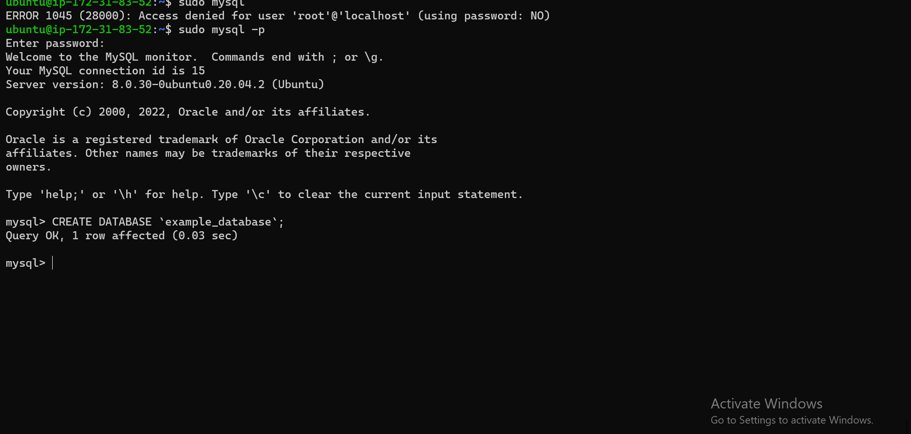

**Database
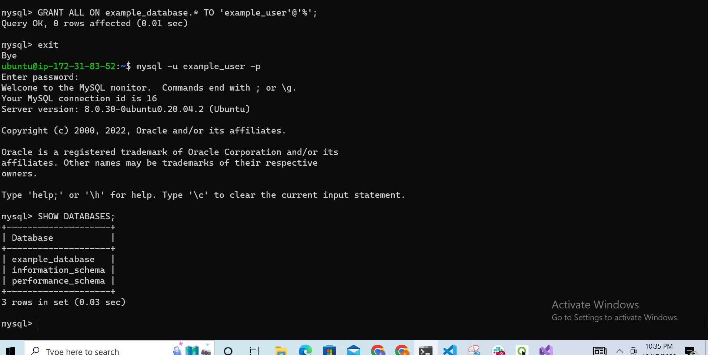

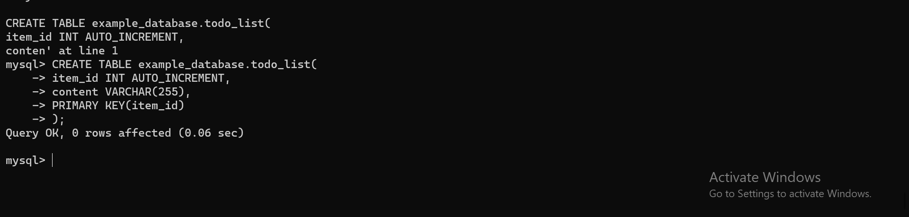

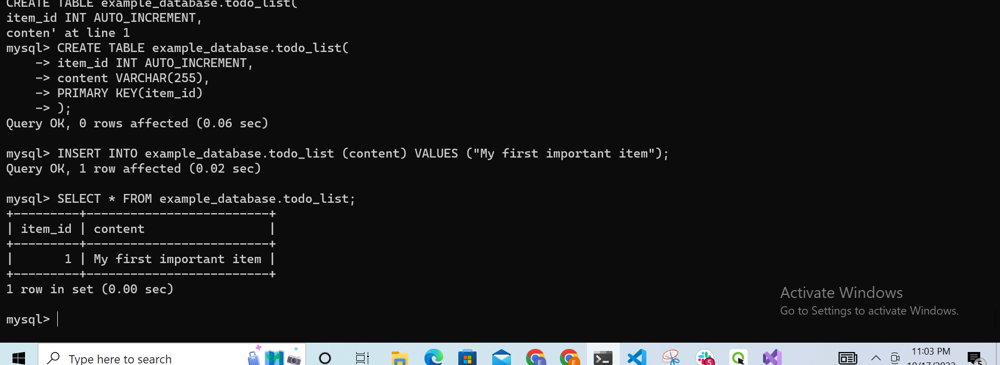